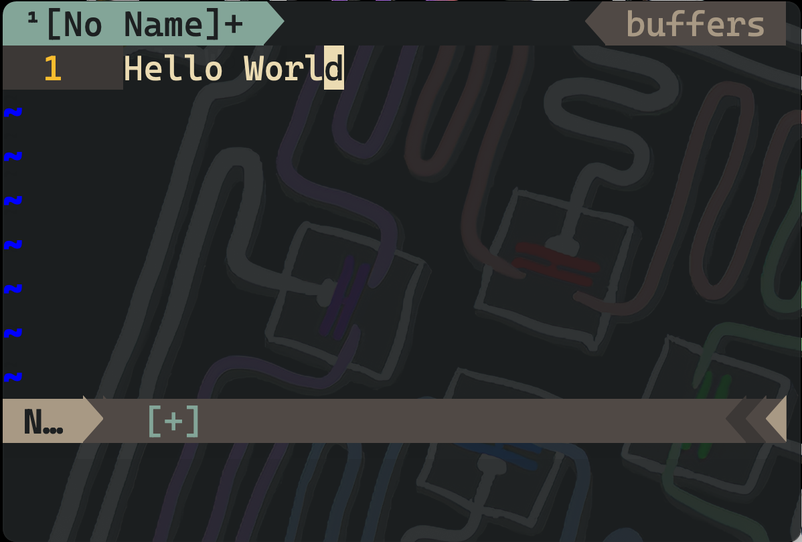
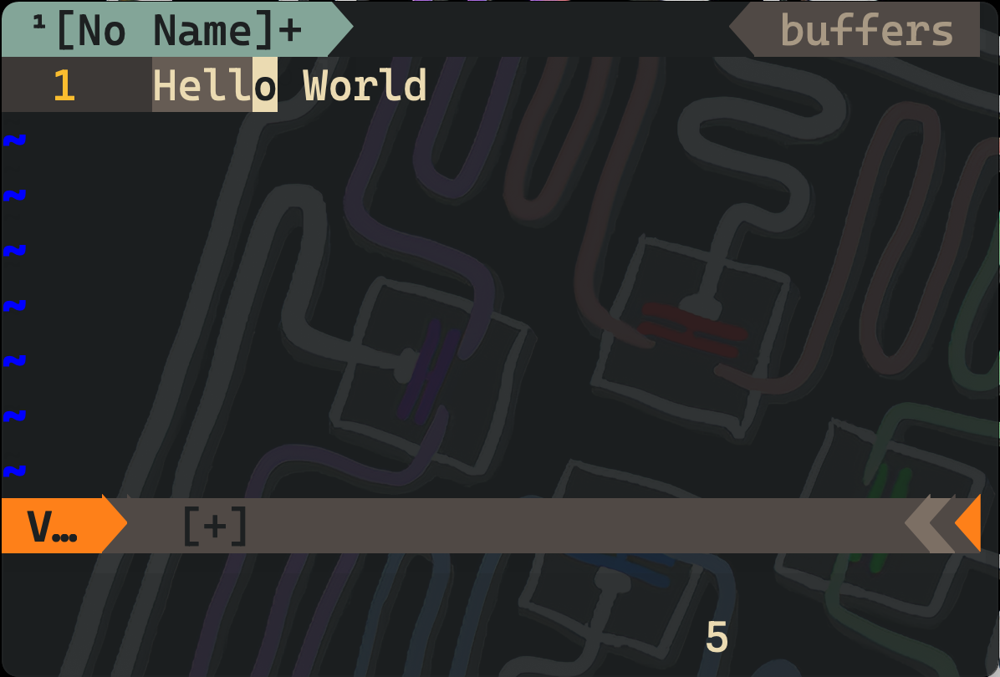
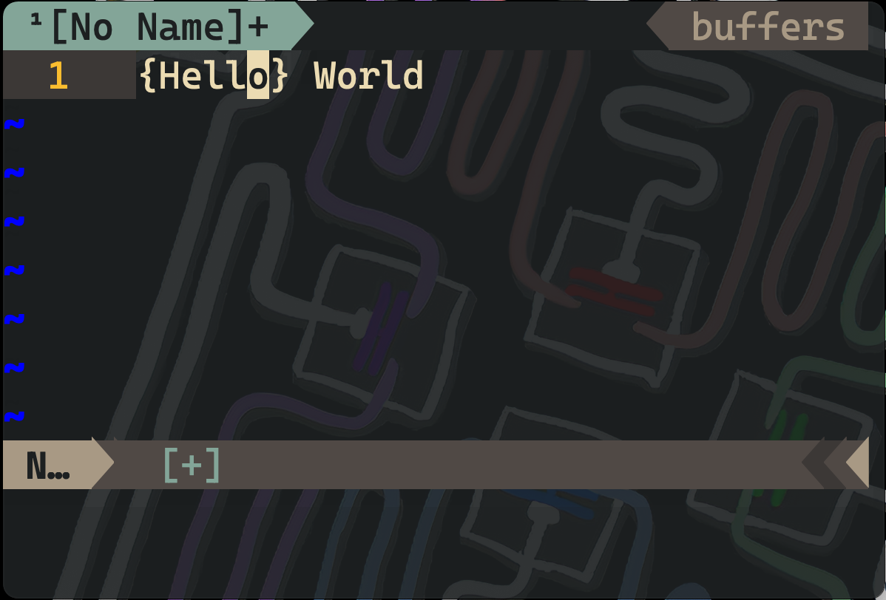

# Vim Pairs Basic
This is a very basic implementation of auto-pairing of brackets and quotations for vim/neovim.
A small tutorial video can be seen [**here**](https://abeervaishnav13.github.io/vim-pairs-basic/).

## Installation
### Through `VimPlug`
- Copy and paste the following line in your vim plug config:
```
Plug 'AbeerVaishnav13/vim-pairs-basic'
```

### Manually
1. Download the files in `.zip` format and unzip the contents.
2. Copy the `plugin/autopair.vim` file in your vim/neovim config directory.
3. Copy and paste this line in your `.vimrc` or `init.vim`:
```
source /path/to/vim/config/directory/autopair.vim
```

## Characters for Pair support
The following characters are supported for pair completion using vim-pairs-basic plugin:<br>
`(`, `{`, `[`, `<`, `'`, `"`, and \`

## Usage
### Single-line pairs
- Insert in pair
```
input: []
output: [|]

input: ""
output: "|"
```

- Insert with `;` or `,`
```
input: (;
output: (|);

input: ";
output: "|";

input: (,
output: (|),

input: ",
output: "|",
```

### Multi-line pairs
- Multi line brackets (the corresponding pair is displayed after pressing `<Enter>` key)
```
input: {<Enter>
output: {
    |
}
```

- Multi line brackets and quotations with `;` or `,`
```
input: {;<Enter>
output: {
    |
};

input: [,<Enter>
output: [
    |
],

input: `;<Enter>
output: `
    |
`;

input: ```<Enter>
output: ```
    |
\```
```

### Replace Surrounding pairs
##### Usage pattern `rs<existing><change-to>`
- Example for quotations - `rs'"` has the following effect:
```
input text: 'Hello'
output text: "Hello"
```

- Example for brackets - `rs({` has the following effect:
```
input text: (2 + 3)
output text: {2 + 3}
```

- Example for quotation and bracket mixed - `rs'<` has the following effect:
```
input text: 'html'
output text: <html>
```

### Surround text with pairs
##### Steps
1. Visually select the text you want to surround with any of the supported pairs.
2. Press one of the supported pair characters for surrounding the selected text with them.
##### Example
- Input text


- Visual selection


- Pressing the `{` key for surrounding selected text with `{.}`


### Delete Surrounding pairs
##### Steps
1. Place the cursor within the pair that you want to delete
2. Use the `ds<pair-char>` command to delete the surrounding bracket/quote pairs.
##### Example
- After typing the `ds{` command, with the cursor inside`{.}`:
```
input text: {Hello World}, you're using vim-pairs-basic.
output text: Hello World, you're using vim-pairs-basic.
```
